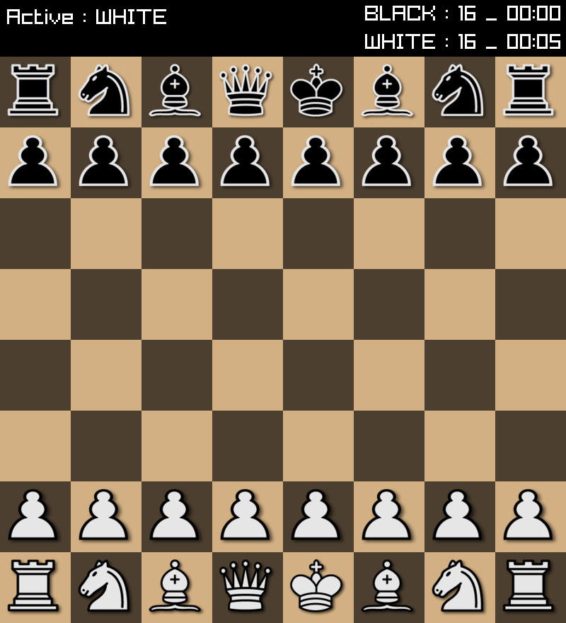

# Game



## TODO
- [ ] menu
- [ ] illegal moves 
- [ ] castling 
- [ ] checkmate
- [ ] multiple resolutions

## build 
```console 
cmake .
make
```

## assets
[JohnPablok's improved Cburnett chess set](https://opengameart.org/content/chess-pieces-and-board-squares)

